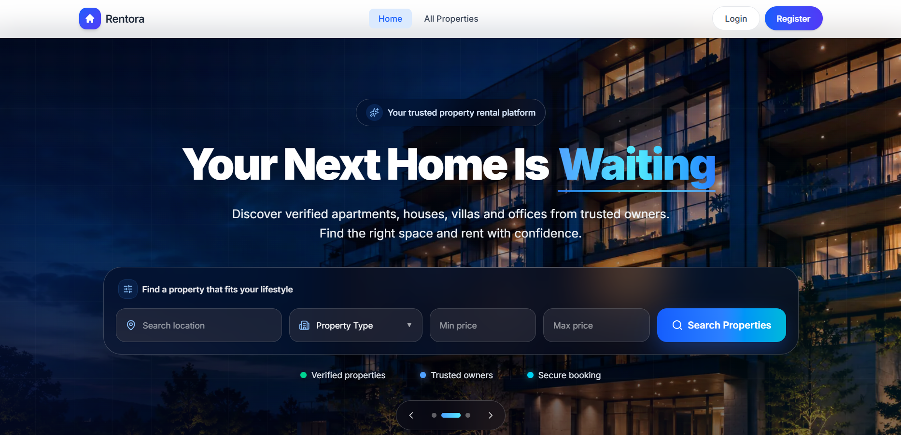
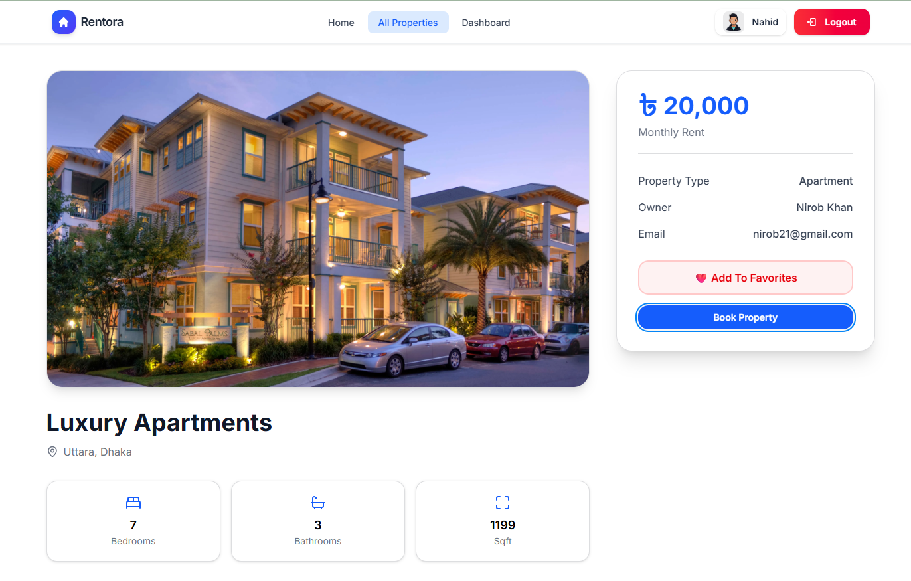
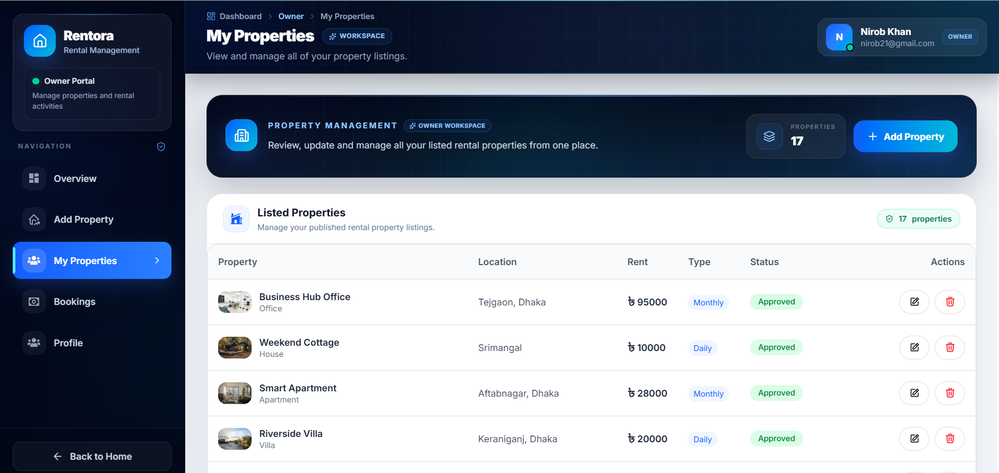
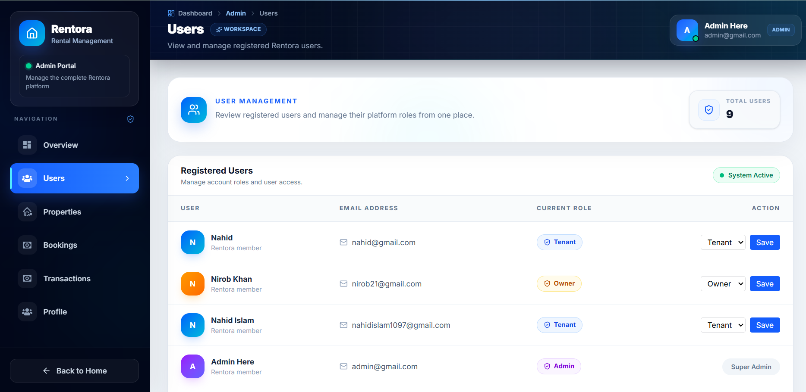

# 🏠 Rentora — Your Next Home Awaits

A modern, full-stack **Property Rental & Booking Platform** that connects **Tenants**, **Property Owners**, and **Administrators** through a secure, responsive, and user-friendly experience.

## 🔑 Admin Credentials

To explore and test all administrative features of the platform, use the following demo account:

## 🔑 Admin Credentials

To access the administrator dashboard and explore all management features, use the following credentials.

| **Field**         | **Credential**    |
| :---------------- | :---------------- |
| **Email Address** | `admin@gmail.com` |
| **Password**      | `admin1234`       |

## 🌐 Live Demo

- 🔗 Live Website: https://rentora-ten-rouge.vercel.app/

## 📂 Source Code

- 💻 Client Repository: https://github.com/nahidforever/Rentora-Client
- ⚙️ Server Repository: https://github.com/nahidforever/Rentora-Server

## 🌍 API Server

- 🚀 Server URL: https://rentora-server-three.vercel.app/

# 📸 Project Preview

## 🏡 Home Page



## 🏠 Property Details



## 📊 Owner Dashboard



## 🛠️ Admin Dashboard



# 📖 Project Overview

**Rentora** is a complete Property Rental & Booking Platform built to simplify the property rental process.

The platform enables tenants to discover rental properties, save favorites, submit reviews, book properties, and complete secure online payments.

Property owners can list and manage properties, monitor bookings, approve reservation requests, and analyze earnings.

Administrators oversee the entire platform by managing users, moderating property listings, monitoring transactions, and ensuring platform integrity.

# ✨ Core Features

## 🔐 Authentication & Authorization

- Email & Password Authentication
- Google Social Login
- Better Auth Authentication
- JWT Authentication
- Role-Based Access Control (RBAC)
- Protected Routes
- Protected APIs
- Session Management

## 🏠 Property Management

- Add Property
- Update Property
- Delete Property
- Property Approval Workflow
- Property Rejection Feedback
- Dynamic Property Details Page
- Property Availability Status

## 🔍 Search, Filter & Sorting

- Search by Location
- Filter by Property Type
- Filter by Price Range
- Sort Price (Low → High)
- Sort Price (High → Low)
- Backend Filtering
- Real-time Search Experience

## ❤️ Favorites

- Add Property to Favorites
- Remove from Favorites
- Personalized Favorites List

## 📅 Booking System

- Book Property
- Booking Request Workflow
- Booking Approval & Rejection
- Booking Status Tracking
- Booking History

## 💳 Secure Stripe Payments

- Stripe Checkout Integration
- Reservation Fee Payment
- Secure Payment Verification
- Transaction History
- Payment Status Tracking

## ⭐ Review System

- Tenant Reviews
- Property Ratings
- Dynamic Review Section
- Review Management

## 📊 Dashboard Analytics

### 👤 Tenant Dashboard

- Total Bookings
- Favorite Properties
- Total Paid Amount
- Booking History

### 🏠 Owner Dashboard

- Analytics Cards
- Monthly Earnings Chart
- Property Management
- Booking Requests

### 👑 Admin Dashboard

- Manage Users
- Manage Properties
- Approve Properties
- Reject Properties
- Delete Properties
- Manage Transactions

# 👥 User Roles

## 👤 Tenant

- Browse Properties
- View Property Details
- Save Favorites
- Book Properties
- Make Payments
- Submit Reviews
- Manage Bookings

## 🏠 Property Owner

- Add New Property
- Update Property
- Delete Property
- View Booking Requests
- Approve / Reject Bookings
- Track Earnings
- Dashboard Analytics

## 👑 Administrator

- Manage Users
- Promote/Demote User Roles
- Approve Properties
- Reject Properties
- Delete Properties
- Monitor Platform Activity
- View Transactions

# 🛠️ Tech Stack

## Frontend

- Next.js 15
- React 19
- Tailwind CSS
- HeroUI
- Framer Motion
- React Icons
- Recharts
- Axios

## Backend

- Node.js
- Express.js
- MongoDB Atlas
- Better Auth

## Authentication

- Better Auth
- Google OAuth

## Payment

- Stripe

## Image Hosting

- ImgBB

# 📦 NPM Packages

## Client

```bash
next
react
react-dom
tailwindcss
@heroui/react
framer-motion
better-auth
react-hot-toast
react-icons
recharts
@stripe/react-stripe-js
@stripe/stripe-js
```

## Server

```bash
express
mongodb
cors
dotenv
better-auth
stripe
```

# 🔒 Security

- Better Auth Authentication
- Role-Based Authorization
- Protected Dashboard Routes
- Protected APIs
- Secure Stripe Payments
- Environment Variables
- Secure MongoDB Credentials

# 📱 Responsive Design

Fully optimized for:

- 📱 Mobile
- 📲 Tablet
- 💻 Laptop
- 🖥️ Desktop

# 🚀 Installation

## Clone Client

```bash
git clone https://github.com/nahidforever/Rentora-Client.git
```

## Clone Server

```bash
git clone https://github.com/nahidforever/Rentora-Server.git
```

## Install Dependencies

```bash
npm install
```

## Run Development Server

```bash
npm run dev
```

# 🌟 Why Rentora?

- Modern UI/UX
- Fully Responsive
- Secure Authentication
- Role-Based Dashboard
- Property Approval Workflow
- Stripe Payment Integration
- Interactive Analytics
- Smooth Animations
- Clean Architecture
- Production Ready

# 👨‍💻 Developer

**MD. Nahid Islam**

- GitHub: [https://github.com/nahidforever](https://github.com/nahidforever)
- LinkedIn: [https://www.linkedin.com/in/nahidforever/](https://www.linkedin.com/in/nahidforever/)
- Email: n.i.nahid02@gmail.com

**Rentora — Your Next Home Awaits 🏡**
